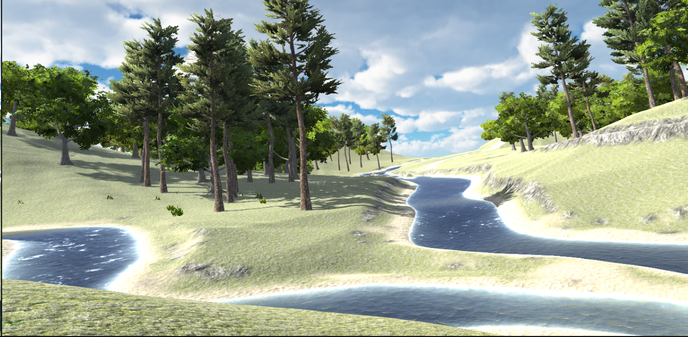
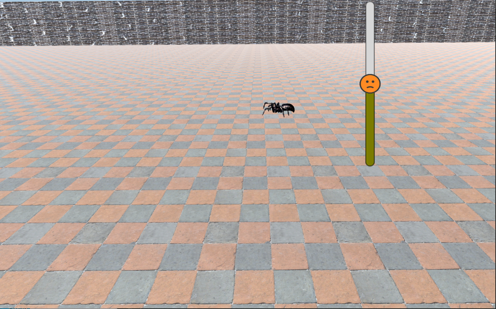
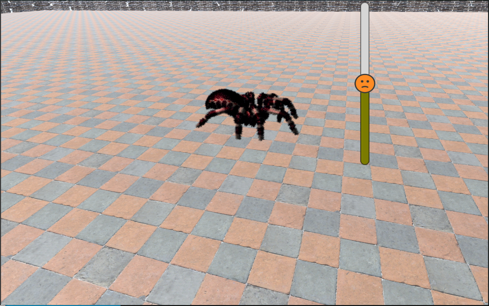
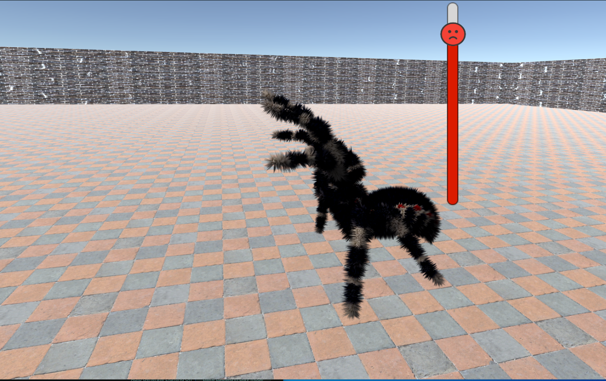

# Spiders Based on Anxiety: How Reinforcement Learning Can Deliver Desired User Experience in Virtual Reality Personalized Arachnophobia Treatment

## Overview

This repository contains code and data for the project **"Spiders Based on Anxiety: How Reinforcement Learning Can Deliver Desired User Experience in Virtual Reality Personalized Arachnophobia Treatment."** The project aims to use Reinforcement Learning (RL) to personalize the experience in Virtual Reality Exposure Therapy (VRET) for individuals with arachnophobia. The system dynamically adjusts spider attributes based on real-time user feedback to optimize therapeutic outcomes.

## Table of Contents

- [Overview](#overview)
- [Folder Structure](#folder-structure)
- [Videos](#videos)
- [Python](#python)
- [Unity](#unity)
- [Data](#data)

## Folder Structure

The repository is organized into three main sections:

- **Python/**: Contains RL and Rules-based models, physiological signal processing scripts, and Unity communication.
- **Unity/**: Contains the Unity project for the VR simulation and scripts for managing adaptive spider behavior.
- **Data/**: Contains human subject experiment data, including Electrodermal Activity (EDA) and Subjective Unit of Distress (SUDs) data.

## Videos

### Relaxing Environment
Watch the relaxing environment here:

### Adaptive Spider
Watch the adaptive spider behavior:

---

## Python

### Overview

The Python folder includes scripts for processing physiological signals and adapting virtual spider attributes in the VR environment using both rule-based and RL methods.

### Key Features
- **Physiological Signal Processing**: Processes EDA signals to estimate user stress levels.
- **Spider Attribute Adaptation**: Adapts spider attributes based on stress levels using rule-based and Q-Learning methods.
- **Multi-threading**: Manages reading signals and writing constants for Unity concurrently.
- **Unity Communication**: Ensures stable interaction with the Unity environment via text files.
- **Logging**: Stores runtime logs for analysis.

---

## Unity

### Overview

The Unity folder contains scripts that implement the VR simulation, allowing users to interact with adaptive spiders that modify their behavior based on real-time input from the Python scripts.

### Key Scripts
- **Logger.cs**: Logs interaction data.
- **InCameraDetector.cs**: Detects visibility of spiders within the camera.
- **Locomotion.cs**: Manages spider movements and animations.
- **setAttributes.cs**: Adjusts spider attributes dynamically.
- **SpiderDriver.cs**: Drives spider actions based on user stress input.

### Note on Assets

Some assets are not included and must be acquired separately:
- **R.A.M - River Auto Material**
- **Giant Spiders Animated**

---

## Visuals

### Relaxing Environment

*An example of the relaxing environment used in the VR simulation.*

### Spider Visuals

*Generated spider with minimum attribute values: small, non-hairy, and gray, standing far from the participant.*

*Generated spider with average attribute values: medium-sized, hairy, and red, walking at a moderate distance from the participant.*

*Generated spider with maximum attribute values: large, hairy, and black, moving quickly and jumping close to the participant.*
